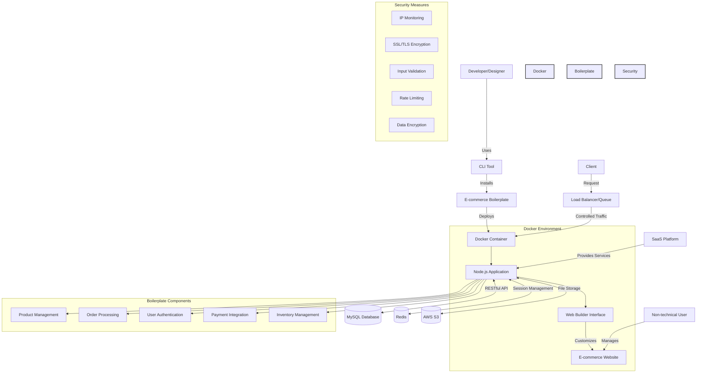

# E-commerce Boilerplate and Framework Development

## Project Overview
Developed a comprehensive e-commerce boilerplate and framework to streamline the creation of e-commerce websites for various industries including fashion, art, high-end furniture, and food & beverage. The project aimed to address recurring needs in e-commerce development, reduce setup time, and enable non-technical users to manage the platform.

## Project Overview
Developed a comprehensive e-commerce boilerplate and framework to streamline the creation of e-commerce websites for various industries including fashion, art, high-end furniture, and food & beverage. The project aimed to address recurring needs in e-commerce development, reduce setup time, and enable non-technical users to manage the platform.


## Architecture


## Key Challenges
- Repetitive server setup and programming tasks for similar e-commerce needs
- Difficulty in platform management for non-developers after implementation
- Complexities in server management

## Technical Implementation
- Created a boilerplate with common e-commerce functionalities
- Developed a CLI-based framework using Node.js modules for easy installation
- Evolved from a model file copying approach to a SaaS (Software as a Service) model
- Implemented Docker containerization for isolated server operations
- Designed a web builder-style, server-installable boilerplate for use by designers

## Achievements
- Significantly reduced development time and effort for new e-commerce projects
- Enabled non-technical users to manage and operate e-commerce platforms
- Improved scalability and maintainability through containerization
- Facilitated easy customization and deployment with the web builder interface

## Technologies Used
- Node.js
- Docker
- CLI development
- SaaS architecture
- Web builder technologies

## Run
```bash
chmod +x create.sh
./create.sh

chmod +x setup.sh
./setup.sh
```